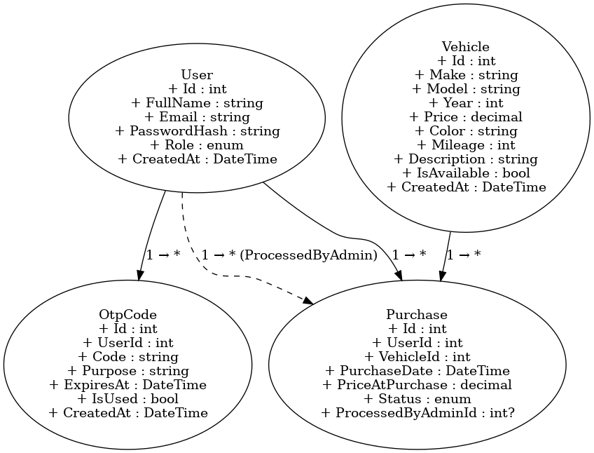

# Dealership Management System

A .NET 9.0 Web API for managing car dealership operations including vehicle inventory, customer management, and sales tracking.

## Project Structure

```
Dealership Management/
├── Controllers/           # API Controllers
│   ├── AuthController.cs
│   ├── PurchasesController.cs
│   └── VehiclesController.cs
├── Data/                  # Data Access Layer
│   └── DealershipDbContext.cs
├── DTOs/                  # Data Transfer Objects
│   ├── AuthDtos.cs
│   ├── PurchaseDto.cs
│   └── VehicleDto.cs
├── Models/                # Entity Models
│   ├── OtpCode.cs
│   ├── Purchase.cs
│   ├── Role.cs
│   ├── User.cs
│   └── Vehicle.cs
├── Services/              # Business Logic Layer
│   ├── AuthService.cs
│   ├── IAuthService.cs
│   ├── IPurchaseService.cs
│   ├── IVehicleService.cs
│   ├── PurchaseService.cs
│   └── VehicleService.cs
├── Security/              # Security Services
│   ├── IOtpService.cs
│   ├── ITokenService.cs
│   ├── OtpService.cs
│   └── TokenService.cs
├── Configurations/        # Configuration Classes
├── Middleware/            # Custom Middleware
├── Program.cs             # Application Entry Point
├── appsettings.json       # Configuration
├── appsettings.Development.json
├── dealership.db          # SQLite Database
├── Migrations/            # EF Core Migrations
├── InitialCreate.sql      # Initial SQL Script
├── README.md              # This File
└── ...
```

## Core Entities

- **User**: Represents a system user (customer or admin).

  - `Id` (int): Primary key
  - `FullName` (string)
  - `Email` (string, unique)
  - `PasswordHash` (string)
  - `Role` (enum): User role (Admin, Customer)
  - `CreatedAt` (DateTime)

- **Vehicle**: Represents a car in the inventory.

  - `Id` (int): Primary key
  - `Make` (string)
  - `Model` (string)
  - `Year` (int)
  - `Price` (decimal)
  - `Color` (string)
  - `Mileage` (int)
  - `Description` (string)
  - `IsAvailable` (bool)
  - `CreatedAt` (DateTime)

- **Purchase**: Represents a vehicle purchase request/transaction.

  - `Id` (int): Primary key
  - `UserId` (int): Foreign key to User
  - `VehicleId` (int): Foreign key to Vehicle
  - `PurchaseDate` (DateTime)
  - `PriceAtPurchase` (decimal)
  - `Status` (enum): Purchase status
  - `ProcessedByAdminId` (int?, nullable): Admin who processed the purchase

- **OtpCode**: Represents a one-time password for sensitive actions.
  - `Id` (int): Primary key
  - `UserId` (int): Foreign key to User
  - `Code` (string)
  - `Purpose` (string)
  - `ExpiresAt` (DateTime)
  - `IsUsed` (bool)
  - `CreatedAt` (DateTime)

---

## 🧠 Design Decisions & Assumptions

- OTP verification is handled in two steps (request and verify) for cleaner separation of concerns.
- Vehicles are treated as unique items (no quantity); sold vehicles are marked IsAvailable = false.
- OTPs are purpose-specific (Register, Login, etc.) and cannot be reused across different actions.

---

## Getting Started

### Clone and Run the App

1. **Clone the repository**

   ```bash
   git clone https://github.com/AbdulazizElsafadi/Dealership-Management.git
   cd "DealershipManagement"
   ```

2. **Install dependencies**

   ```bash
   dotnet restore
   ```

3. **Create the database**

   ```bash
   dotnet ef database update
   ```

4. **Database Details (SQLite)**

   - The application uses a local **SQLite** database by default.
   - The database file is named `dealership.db` and is located in the `DealershipManagement` directory.
   - The default connection string can be found and modified in `appsettings.json`:

     ```json
     "ConnectionStrings": {
       "DefaultConnection": "Data Source=dealership.db"
     }
     ```

   - If you wish to connect to a different SQLite file or use another database provider, update the `DefaultConnection` value in `DealershipManagement/appsettings.json` accordingly.
   - You can use any SQLite client (such as [DB Browser for SQLite](https://sqlitebrowser.org/)) to open and inspect the `dealership.db` file.

5. **Run the application**

   ```bash
   dotnet run
   ```

6. **Access the API**
   - API: `https://localhost:5220`
   - Swagger UI: `https://localhost:5220/swagger`

---

## API Endpoints

### Auth Endpoints

| Method | Path                           | Description                          | Roles     |
| ------ | ------------------------------ | ------------------------------------ | --------- |
| POST   | /api/auth/register/request-otp | Request OTP for registration         | Anonymous |
| POST   | /api/auth/register/verify-otp  | Verify OTP and complete registration | Anonymous |
| POST   | /api/auth/login/request-otp    | Request OTP for login                | Anonymous |
| POST   | /api/auth/login/verify-otp     | Verify OTP and login (returns JWT)   | Anonymous |
| GET    | /api/auth/customers            | List all customers                   | Admin     |

### Vehicle Endpoints

| Method | Path                             | Description                              | Roles           |
| ------ | -------------------------------- | ---------------------------------------- | --------------- |
| GET    | /api/vehicles                    | Get all vehicles (with optional filters) | Customer, Admin |
| GET    | /api/vehicles/{id}               | Get vehicle by ID                        | Customer, Admin |
| POST   | /api/vehicles                    | Create new vehicle                       | Admin           |
| PUT    | /api/vehicles/{id}               | Update vehicle (OTP required)            | Admin           |
| DELETE | /api/vehicles/{id}               | Delete vehicle                           | Admin           |
| POST   | /api/vehicles/request-update-otp | Request OTP for updating a vehicle       | Admin           |

### Purchase Endpoints

| Method | Path                         | Description                       | Roles    |
| ------ | ---------------------------- | --------------------------------- | -------- |
| POST   | /api/purchases/request       | Request a purchase (OTP required) | Customer |
| POST   | /api/purchases/request-otp   | Request OTP for purchase          | Customer |
| GET    | /api/purchases/history       | Get purchase history              | Customer |
| GET    | /api/purchases               | Get all purchases                 | Admin    |
| GET    | /api/purchases/{id}          | Get purchase detail               | Admin    |
| PUT    | /api/purchases/complete/{id} | Complete a purchase               | Admin    |

---

## Database Design



## Technology Stack

- **.NET 9.0**
- **ASP.NET Core Web API**
- **Entity Framework Core**
- **SQL Server LocalDB**
- **Swagger/OpenAPI**

## API Documentation

The API documentation is available through Swagger UI at `/swagger` when running in development mode.

## Development

### Adding New Features

1. Create model in `Models/` folder
2. Create DTOs in `DTOs/` folder
3. Add service interface and implementation in `Services/` folder
4. Create controller in `Controllers/` folder
5. Update `Program.cs` to register new services
6. Add database migration if needed

### Database Migrations

```bash
# Create migration
dotnet ef migrations add <MigrationName>

# Update database
dotnet ef database update
```

## License

This project is for educational purposes as part of a .NET coding challenge.
